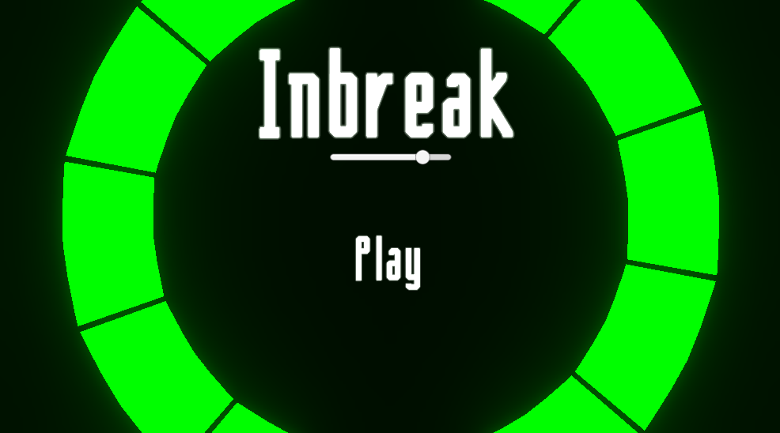
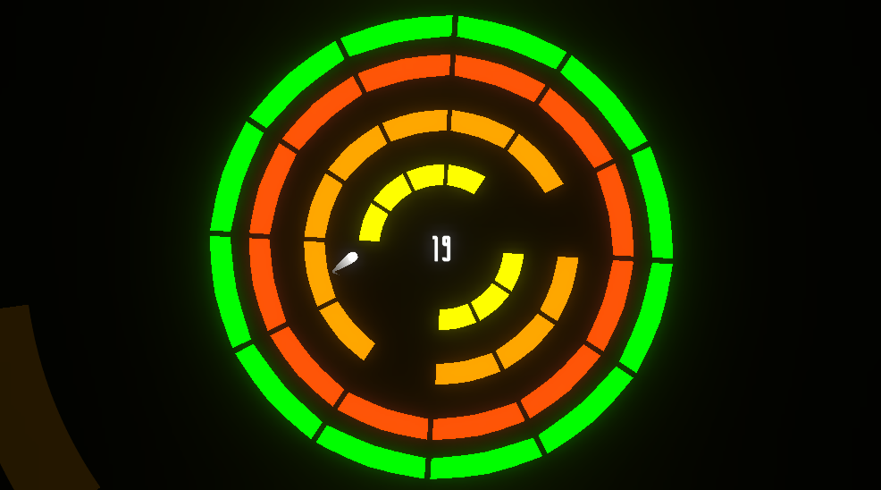
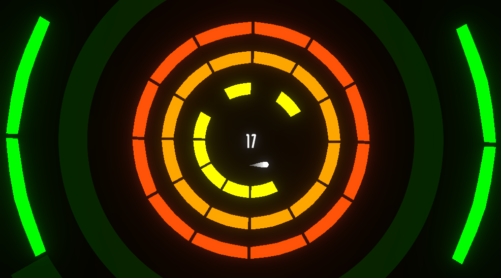

<h2>Inbreak</h2>

Inbreak is an arcade game inspired by breakout made with Unity3D for Ludum dare 47. 
The player must use rotate a set of circle in order to keep the ball object inside as the circles crumbles from getting hit.

Play here: https://lamonfly.itch.io/inbreak
<h3>Gameplay</h3>

